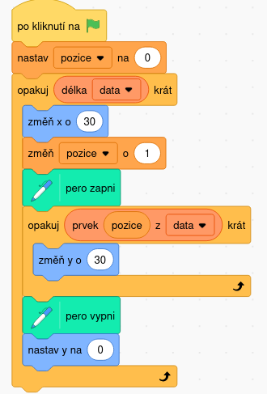

## Ukoly na flowcharty
Otevrete [app.diagrams.net](https://app.diagrams.net) a navrhnete vyvojove diagramy pro nasledujici programy.
Algorimus je vzdy v pseudokodu a pythonu.

### Program 1
```pseudo
i = 1
opakuj 10 krat:
    vypis i
    zvys i o 1
```
```python
i = 1
while i < 10:
    print(i)
    i += 1
```
### Program 2`
```pseudo
i = 0
opakuj 11 krat:
    pokud i delitelne 2:
        vypis i
    zvys i o 1
```
```python
i = 0
while i <= 10:
    if i % 2 == 0:
        print(i)
    i += 1
    
```

### Program 3
```pseudo
i = 0
smer = 0

opakuj 360 krát:
    self.forward(100)
    pen.down()
    pen.up()
    self.backwards()
    smer += 1
    i += 1
```

### Program 4
